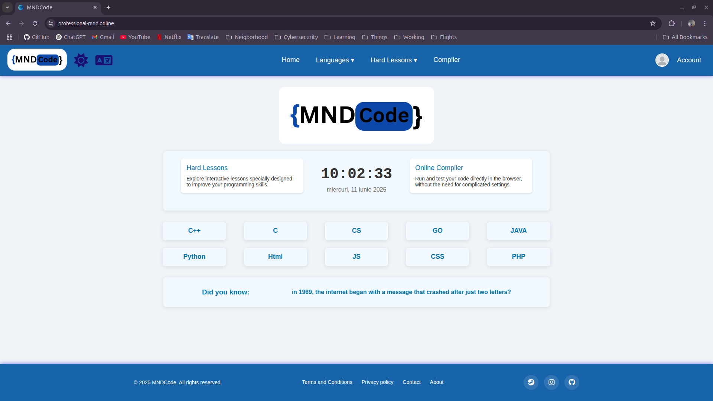
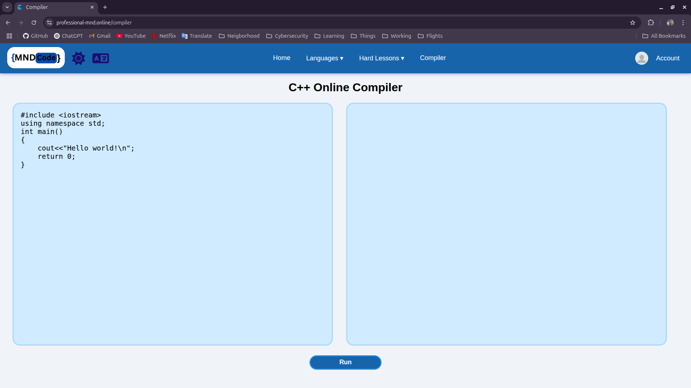
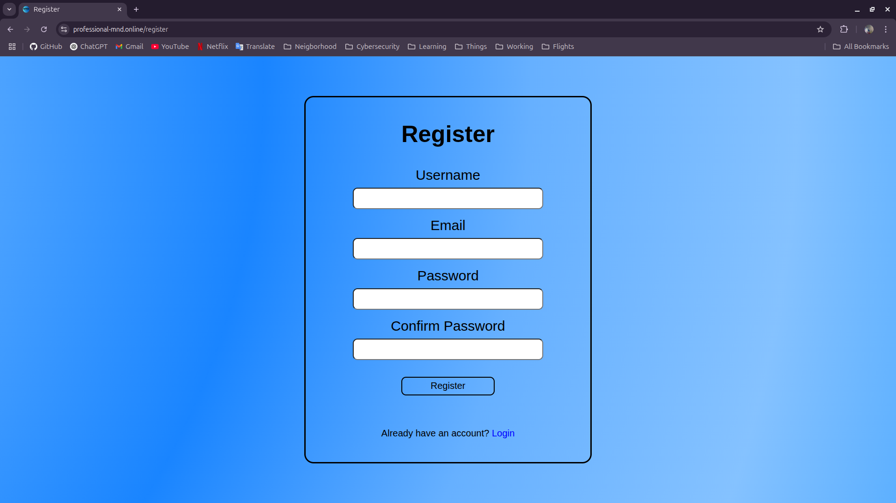
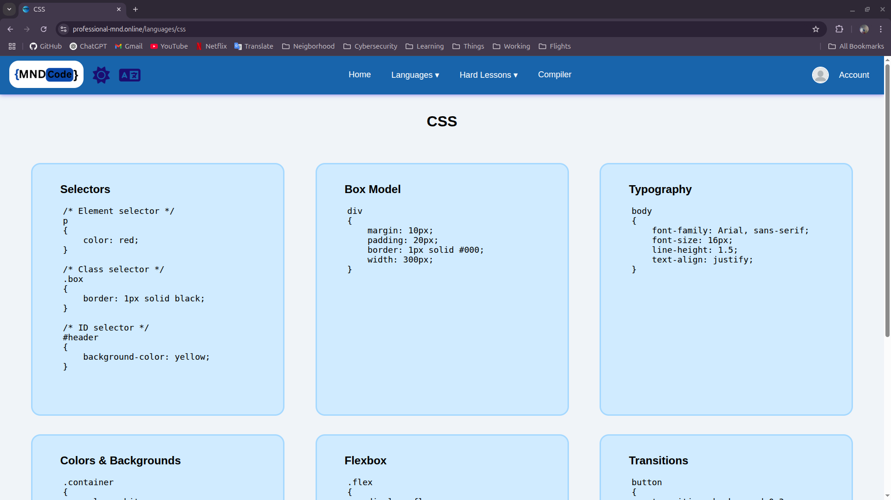
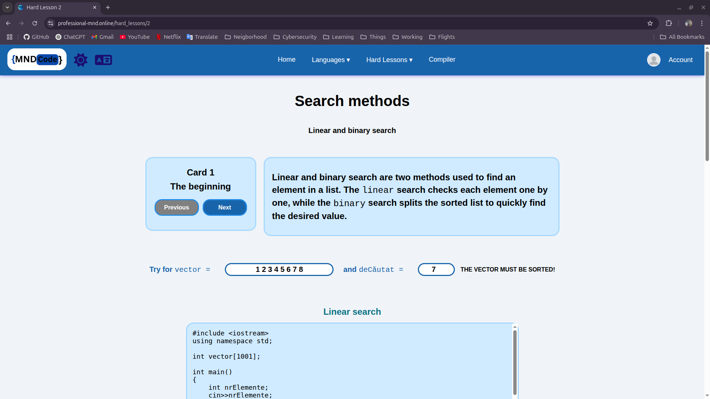
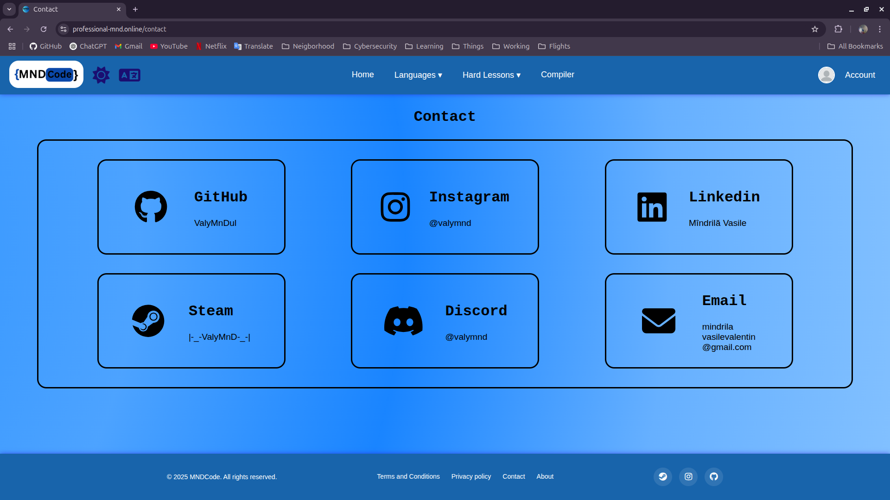

# MNDCode
**Learn Programming the Smart Way!**  

## 🚀 Introduction  
**MNDCode** is an interactive platform designed to teach programming concepts `step by step`. Whether you're a beginner or looking to polish your skills, **MNDCode** provides engaging lessons and practical exercises.

## 👨‍💻 Perfect for

- Absolute beginners starting their coding journey
- Intermediate learners who want to reinforce fundamentals
- Teachers looking for interactive tools to engage students
- Anyone who enjoys learning by building

## 👀 Preview
**Home**    

    

**Compiler**



**Register**



**Lesson**



**Search methods**



**Contact**



## ⚙️ Installation  
**Clone the repo**  
```bash
git clone https://github.com/ValyMnDul/MNDCode.git
cd MNDCode
```
**Install the dependencies**
```bash
sudo npm install
```
**Run the app**
```bash
node app.js
```

