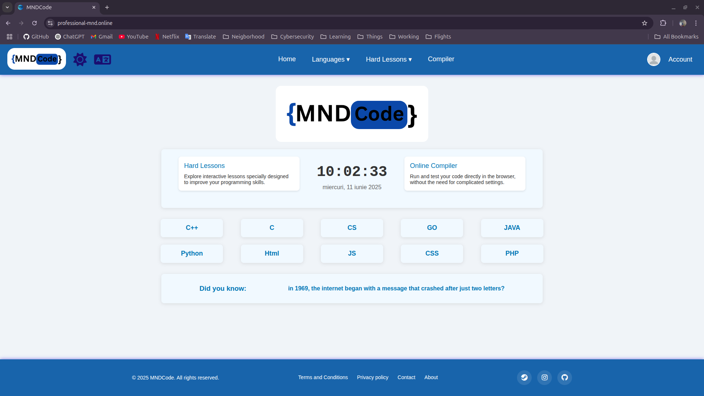
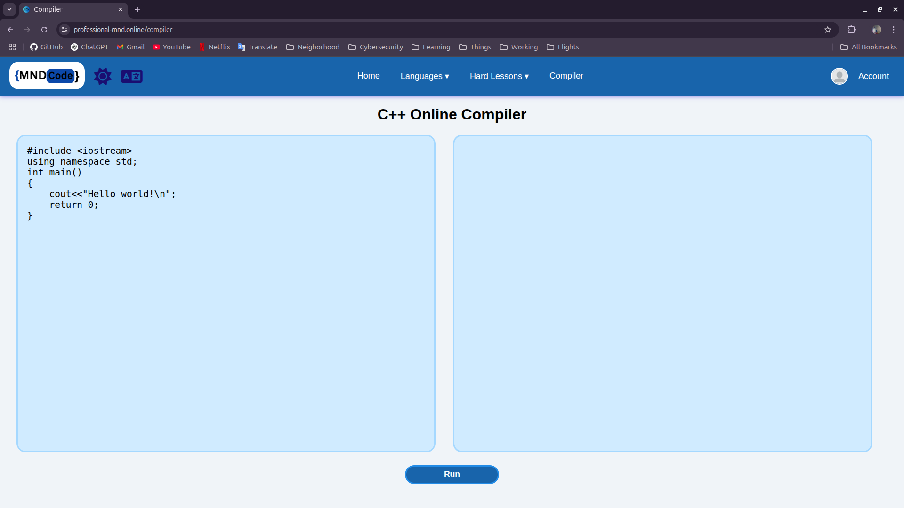
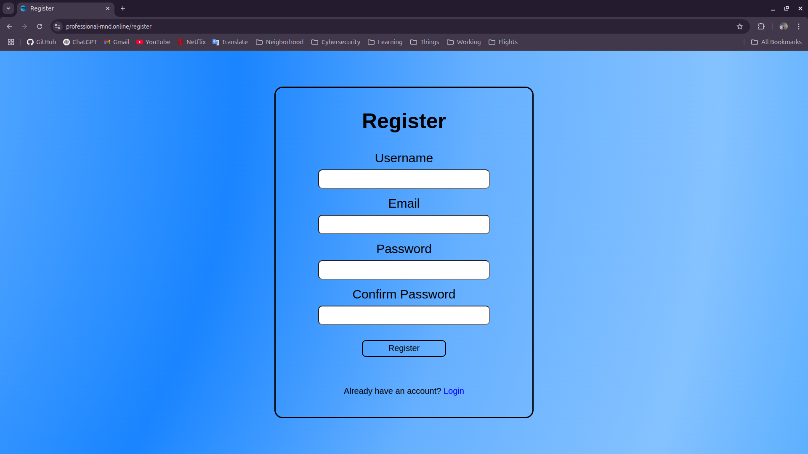
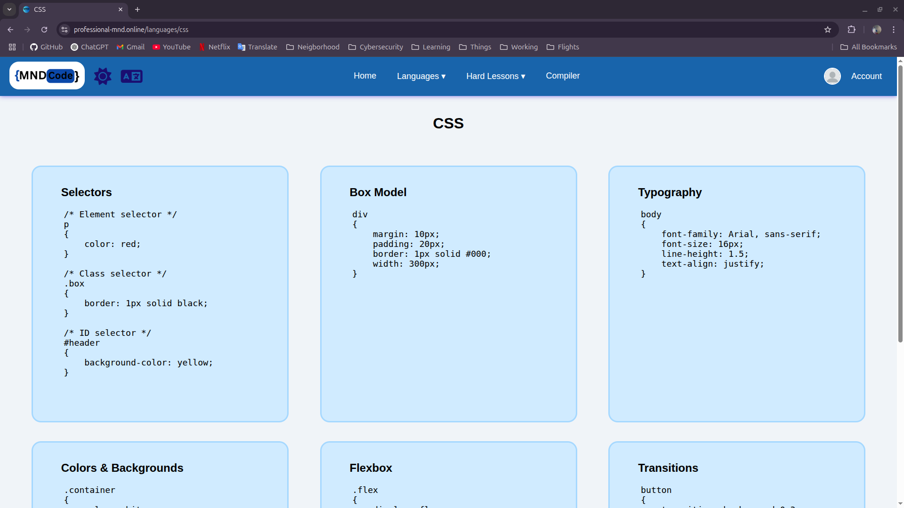
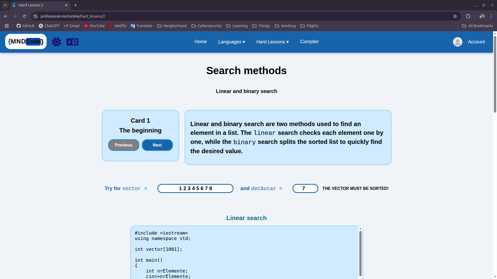

# MNDCode
**Learn Programming the Smart Way!**  

## Introduction  
**MNDCode** is an interactive platform designed to teach programming concepts `step by step`. Whether you're a beginner or looking to polish your skills, **MNDCode** provides engaging lessons and practical exercises.

## Perfect for

- Absolute beginners starting their coding journey
- Intermediate learners who want to reinforce fundamentals
- Teachers looking for interactive tools to engage students
- Anyone who enjoys learning by building

## Preview
**Home**    

    

**Compiler**

**Register**

**Lesson**

**Search methods**

## Contributing

Pull requests are welcome! If you'd like to contribute or suggest features, feel free to open an issue or fork the repo.

## Open Sorce

MNDCode is under [MIT LICENCE](https://github.com/valymndul/mndcode/blob/main/LICENSE.md)

### Project made in California for Neighgorhood event, hosted by HackClub
